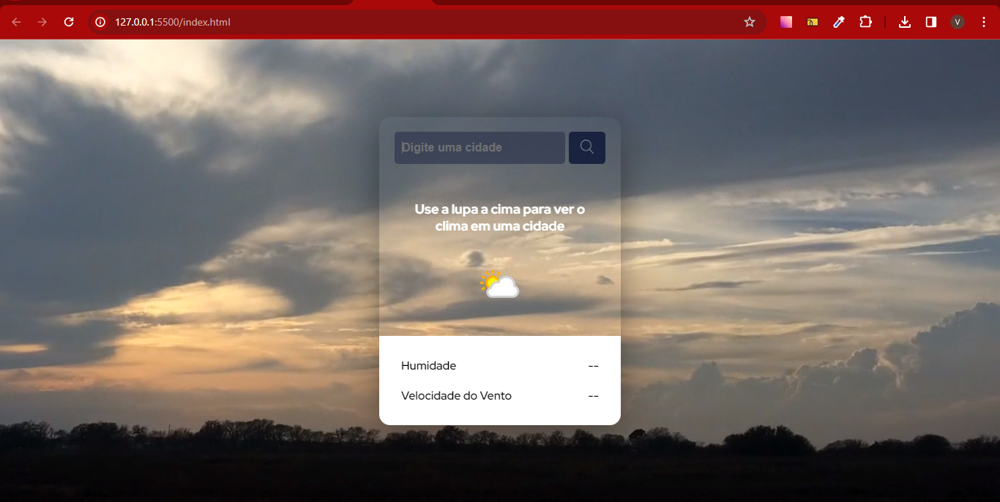
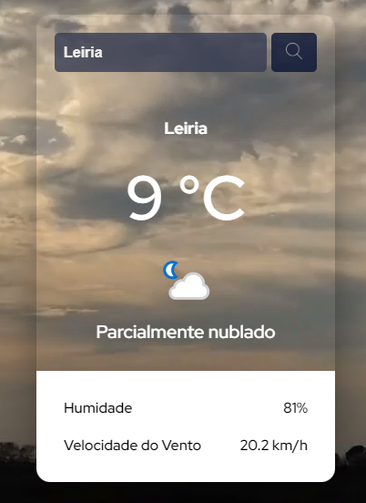
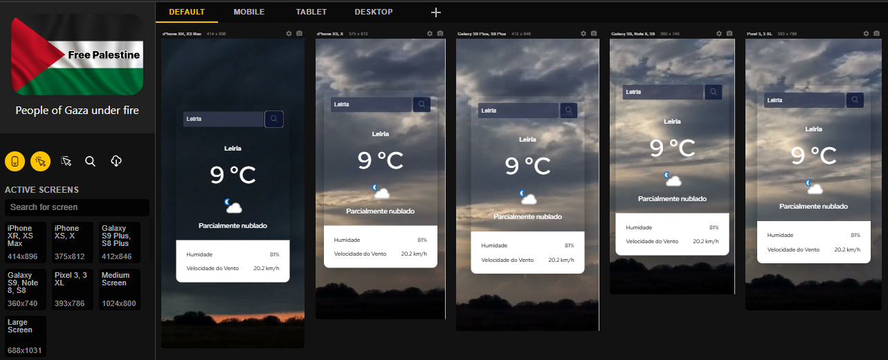
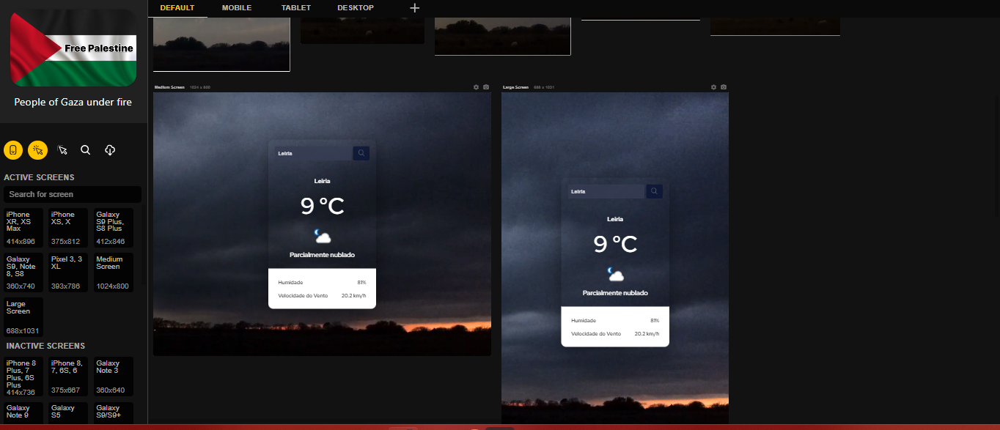

# Projeto APP - Previsão do tempo

Este é um projeto para criar um app de previsão de tempo com uma API gratuita Free Weather API. Este desafio foi realizado pelo curso [Devquest](https://devemdobro.com/matriculas-abertas/) com a finalidade de nos ajudar a melhorar nossas habilidades na codificação através de projetos realistas.

## Índice

- [Visão geral](#visao-geral)
  - [O desafio](#o-desafio)
  - [Captura de tela](#captura-de-tela)
  - [Links](#links)
- [Meu processo](#meu-processo)
  - [Construído com](#construído-com)
  - [O que eu aprendi](#o-que-eu-aprendi)
  - [Recursos úteis](#recursos-úteis)

## Visão geral

### O desafio

Os usuários devem ser capazes de:

- Vêr o layout ideal da página dependendo do tamanho da tela do dispositivo
- Veja os estados de foco para todos os elementos interativos na página
- Buscar a cidade desejada

### Captura de tela

### Links

- URL da API gratuita Free Weather API: [Clique aqui](https://www.weatherapi.com/)

## Meu processo

### Construído com

- Semântica HTML5
- Propriedades personalizadas CSS
- Flexbox
- JavaScript

### O que eu aprendi

- Tags semânticas: esta consegue informar ao navegador com mais especificidade o conteúdo a ser interpretado.
- Flexbox: o trabalho com o flexbox me ajudou a organizar meus elementos HTML dentros de containers de uma forma completa.
- API: usar API permite obter dados dinâmicos em páginas web.
